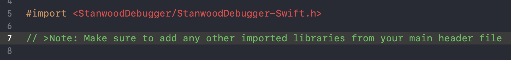

# StanwoodCore framework

[]()
[]()

Debugging and testing iOS applications can be quite a long task due to the nature of Software Development. _StanwoodDebugger_ tool provides reach information on Analytics, Errors, Logging, Networking, and UITesting to simplify this process.


## Table of contents

- [Author](#author)
- [Installation](#installation)
- [Usage](#usage)
- [Licence](#licence)
- [Changelog](#changelog)


## Author

Tal Zion tal.zion@stanwood.io

## Installation

```ruby
pod 'StanwoodDebugger', :configurations => ['Debug'] # Make sure to only use StanwoodDebugger for development only.
```

## Usage

```swift
#if DEBUG
import StanwoodDebugger
#endif

@UIApplicationMain
class AppDelegate: UIResponder, UIApplicationDelegate {

    var window: UIWindow?

    #if DEBUG
    lazy var debugger: StanwoodDebugger = StanwoodDebugger()
    #endif

    func application(_ application: UIApplication, didFinishLaunchingWithOptions launchOptions: [UIApplicationLaunchOptionsKey: Any]?) -> Bool {

        #if DEBUG
        debugger.isEnabled = true
        #endif
    }
}
```

### Other options

```swift
debugger.tintColor = .red /// Change the tint color
debugger.errorCodesExceptions = [4097] /// Add error code exceptions
debugger.isEnabled = true
```

## Adding logs

### Analytics

##### Option 1.

Set up your tracking payload:

```swift
public func payload() -> [String:String] {

    var payload: [String:String] = ["eventName": eventName]

    if let itemId = itemId {
        payload["itemId"] = itemId
    }

    if let category = category {
        payload["category"] = category
    }

    if let contentType = contentType {
        payload["contentType"] = contentType
    }

    if let screenName = screenName {
        payload["screenName"] = screenName
    }

    let dateFormatter = DateFormatter()
    dateFormatter.dateFormat = "yyyy-MM-dd'T'HH:mm:ssZ"

    payload["createdAt"] = dateFormatter.string(from: Date())

    return payload
}
```
Post it to:

```swift
func post(_ payload: [String:String]) {
    let notificationCentre = NotificationCenter.default
    let notification = Notification.init(name: Notification.Name(rawValue: "io.stanwood.debugger.didReceiveAnalyticsItem"), object: nil, userInfo: payload)
    notificationCentre.post(notification)
}
```


##### Option 2.

Use [StanwoodAnalytics](https://github.com/stanwood/Stanwood_Analytics_iOS) as your tracking framework

```swift
#if DEBUG
analyticsBuilder = analyticsBuilder.setDebuggerNotifications(enabled: true)
#endif
```

### Networking

`StanwoodDebugger` works by default with `URLSessiosn.shared` and request are beeing logged for free. You can also register a custom condiguration: 

```swift
let configuration = URLSessionConfiguration.waitsForConnectivity

debugger.regsiter(custom: configuration)

/// Use with URLSession || any networking libraries such as Alamofire and Moya
let session = URLSession(configuration: configuration)
```


### Error

`StanwoodDebugger` will log `NSError` by default.  To add log exceptions:

```swift
debugger.errorCodesExceptions = [4097] /// Add error code exceptions
```

### Logs

`StanwoodDebugger` will log `print` && `debugPrint` by default.

#### Configuration:

1. Create a new `Bridging-Header` file and add `-DEBUG` suffix


2. Import `StanwoodDebugger`

```objc
#import <StanwoodDebugger/StanwoodDebugger-Swift.h>
```

>Note: Make sure to add any other imported libraries from your main header file



3. Set `Bridging-Header-DEBUG.h` in the relevant configurations in the build settings.


### Crashes

## Licence

StanwoodDebugger is under MIT licence. See the [LICENSE](https://github.com/stanwood/Stanwood_Debugger_iOS/blob/master/LICENSE.md) file for more info.

## Changelog

A brief summary of each StanwoodDebugger release can be found in the [CHANGELOG](https://github.com/stanwood/Stanwood_Debugger_iOS/blob/master/CHANGELOG.md).

